# IT-conference-manager
Sii Recruitment task

# Overwiev
This application is the backend for an IT conference management website. It allows, for example, to view the agenda of the entire conference, view reservations of a specific person, or add and delete reservations. Users of this application can also update their email. The application allows you to display how many percent of seats at lectures are occupied and which topic of lectures is most often chosen by participants.

# How to run
To make running the application easier, I have prepared the `run.bat` file. Just click on it to start the application.

# Example commands
<i>To test whole application I used Postman API client.</i>

## Return conference agenda
Command:  `http://localhost:8080/api/agenda`

Result: 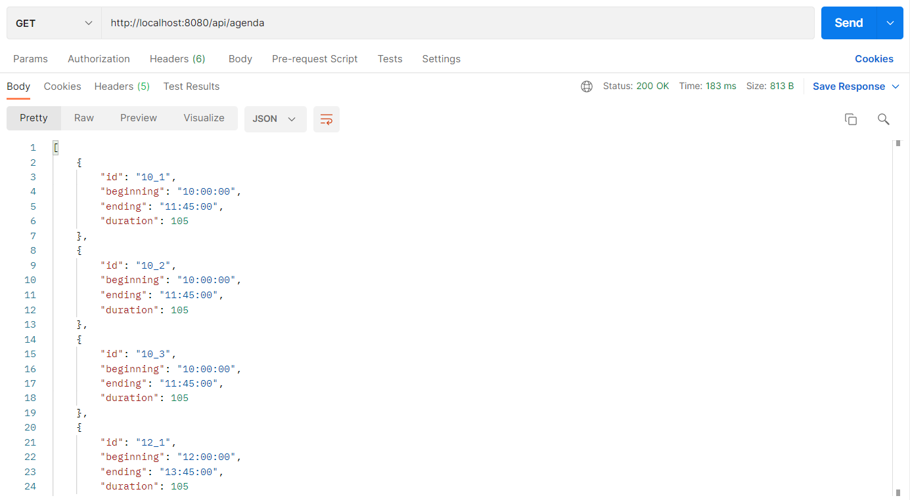

## Return specific user reservations
Command:  `http://localhost:8080/api/reservations?login=ExampleUser3`

Result: 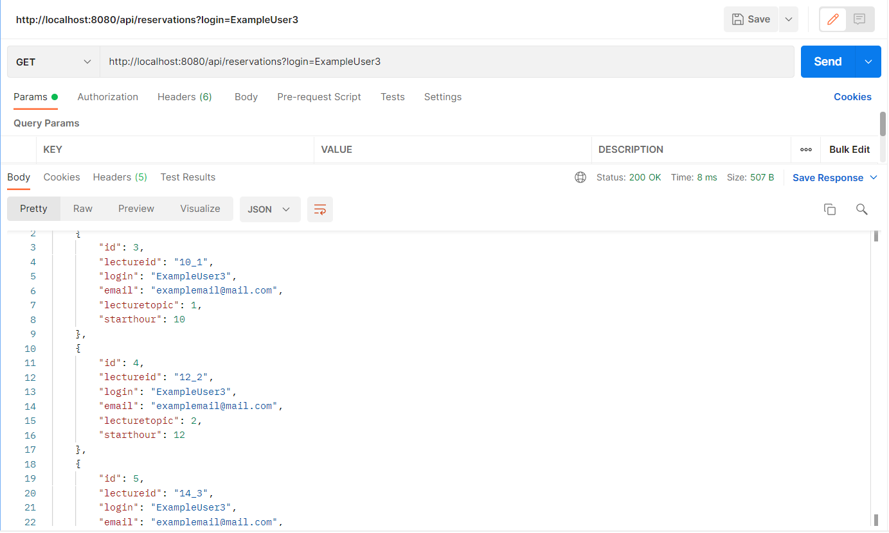
## Add a reservation
Command:  `http://localhost:8080/api`

Http POST body JSON:

`{
"lectureid":"10_1",
"login":"ExampleUser",
"email":"example@mail.com"
}`

Result: 

Screenshot from messages.txt:

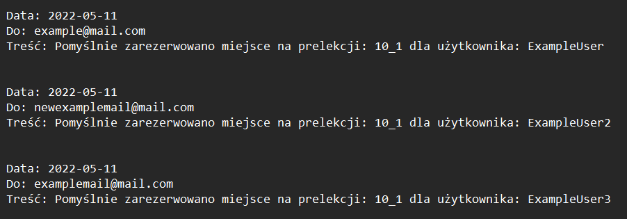
## Cancel a reservation
Command:  `http://localhost:8080/api?id=14_1&login=UserToDelete`

Result: 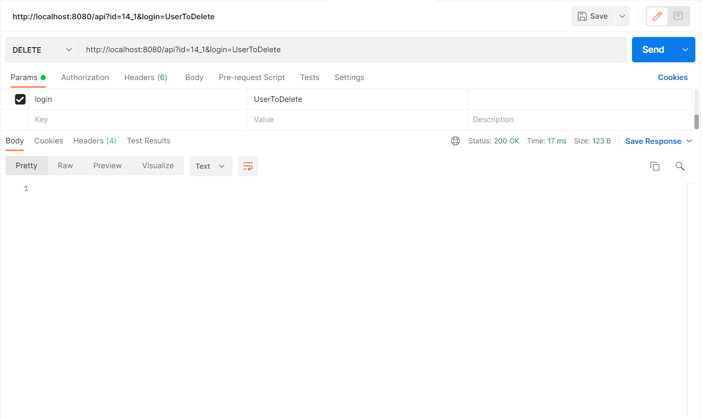

After executing the command, the reservation of this user is no longer available in the database:
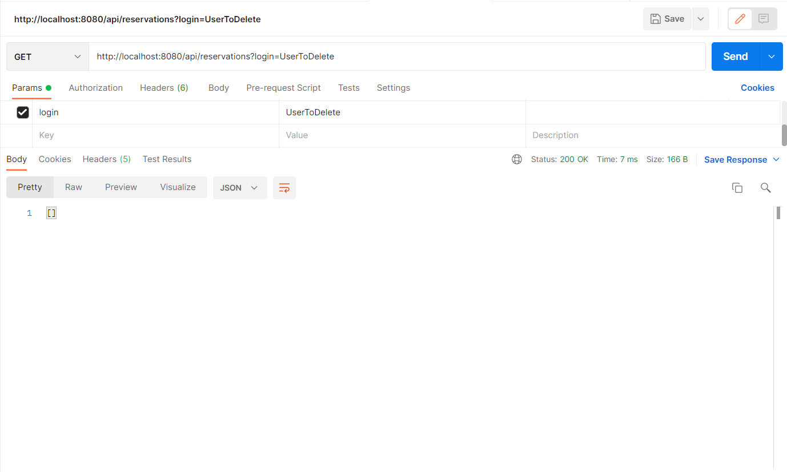
## Update a user's email address
Command:  `http://localhost:8080/api`

Http POST body JSON:

`{
"login":"ExampleUser",
"email":"newexamplemail@mail.com"
}`

Result: 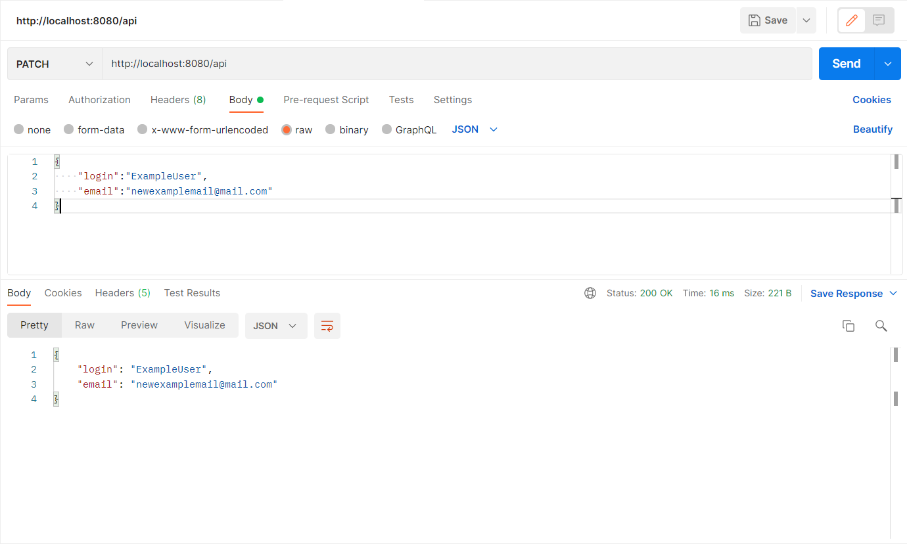

## Return a list of all users and their email addresses
Command:  `http://localhost:8080/api/users/all`

Result: 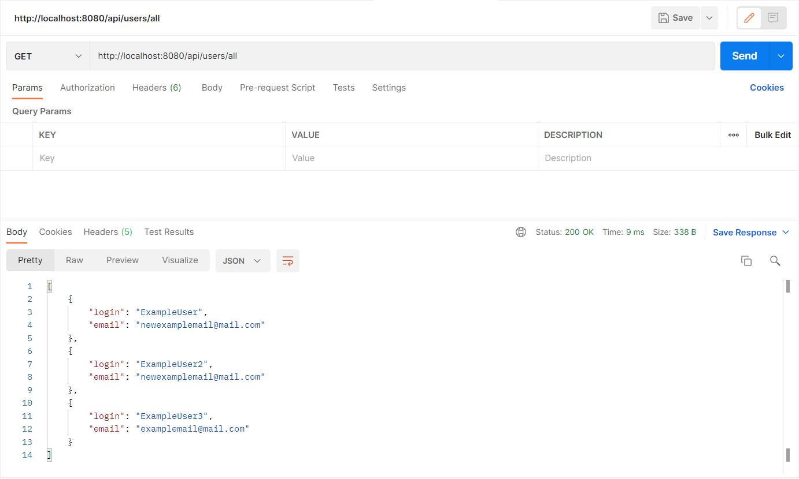
## Generate summary of results:

### by lecture ID
Command:  `http://localhost:8080/api/results/lecture`

Result: 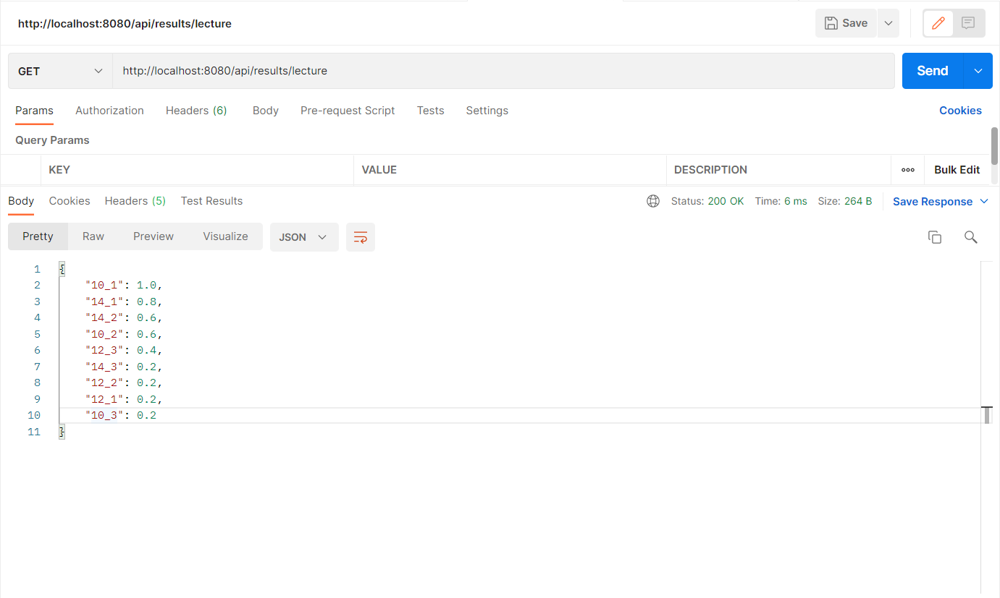

### by lecture topic
Command:  `http://localhost:8080/api/results/lecturetopic`

Result: 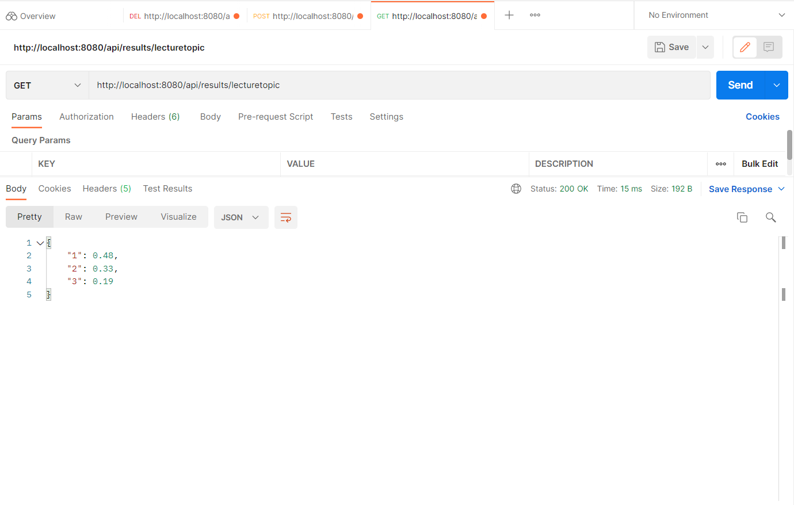

#Example errors

## When there are no seats left for a given lecture:
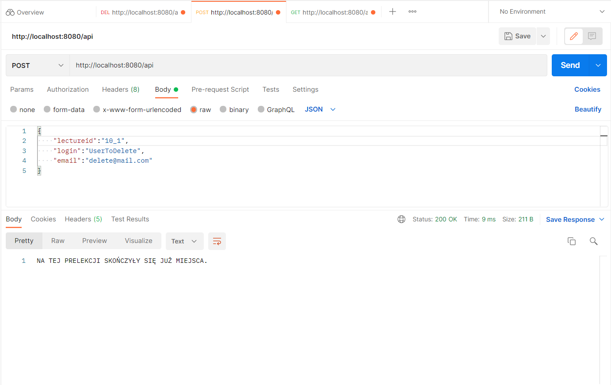
## When the given login is already taken:
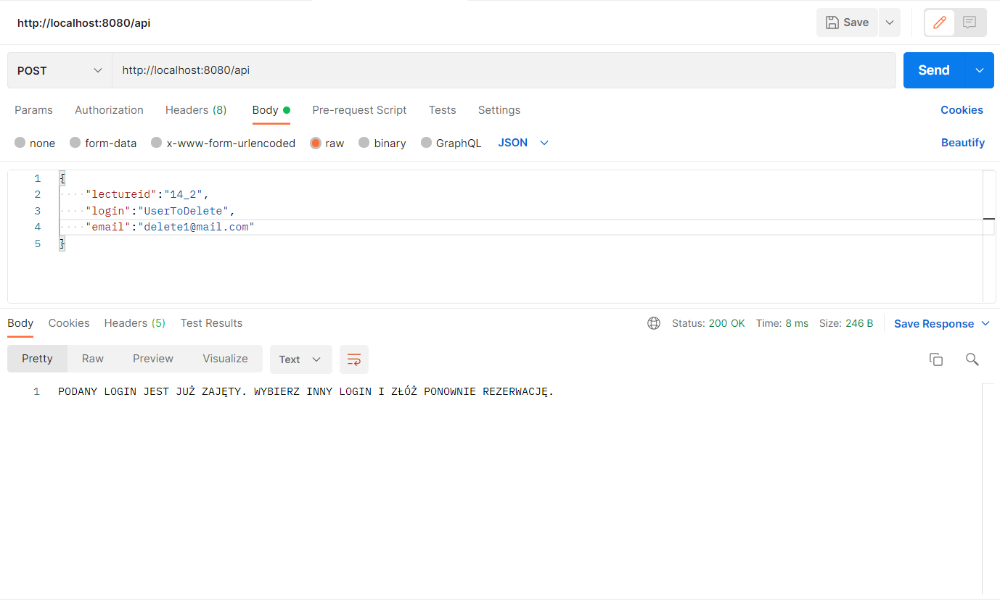
## When a given user is already registered for another conference at the same time:
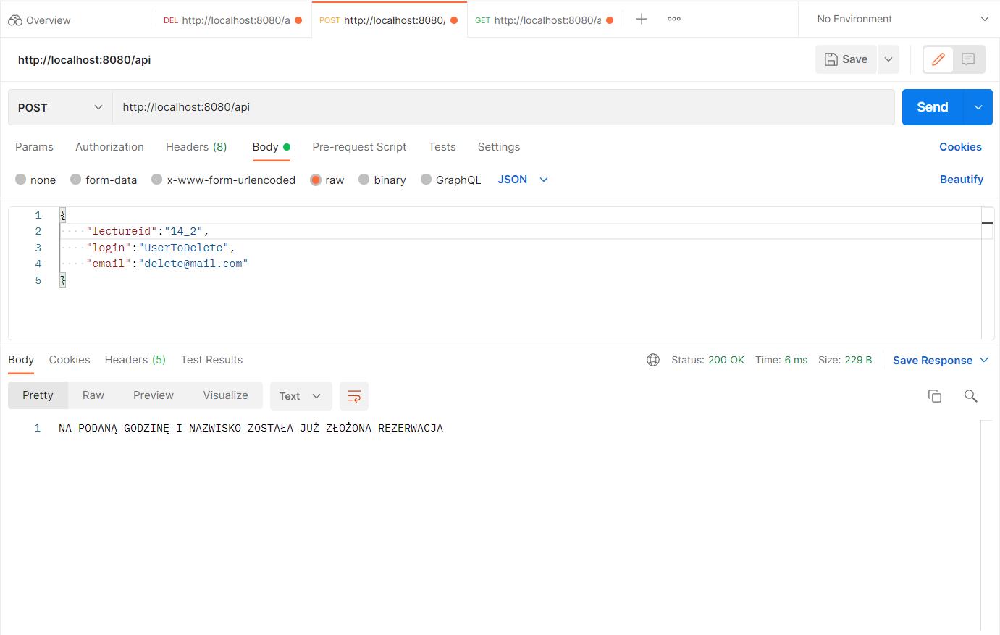
